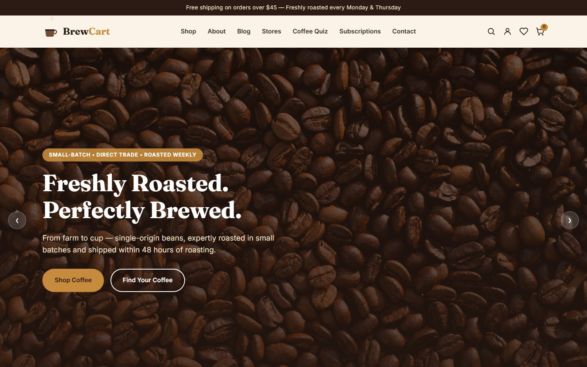
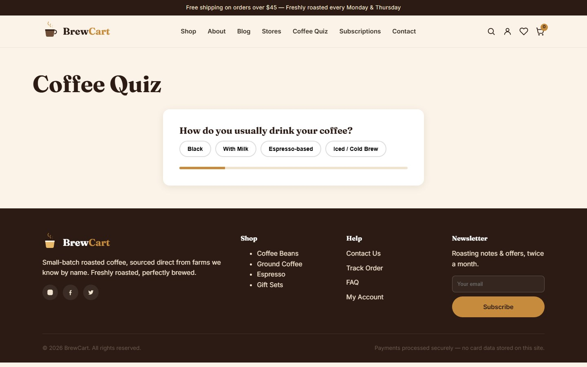
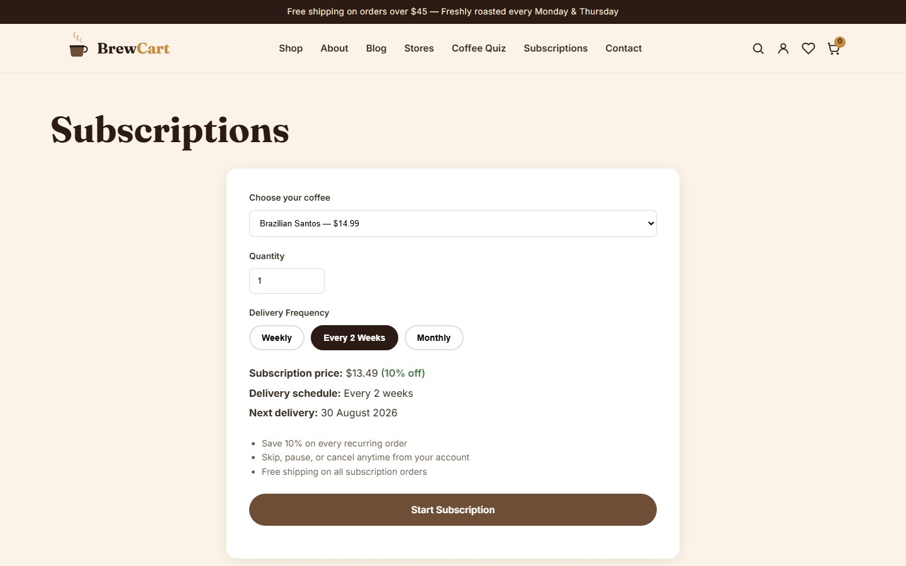
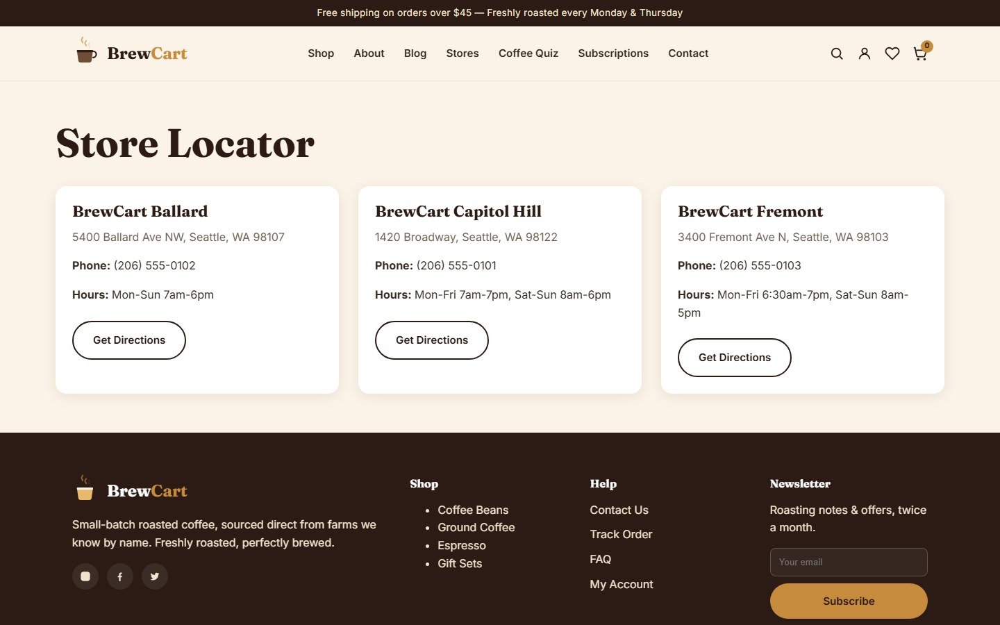
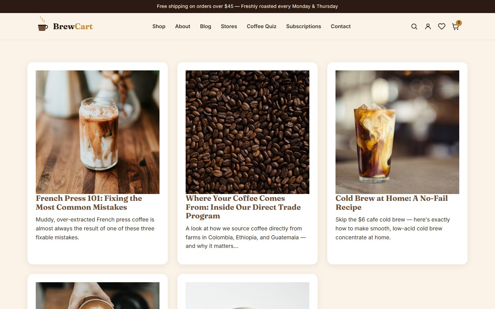
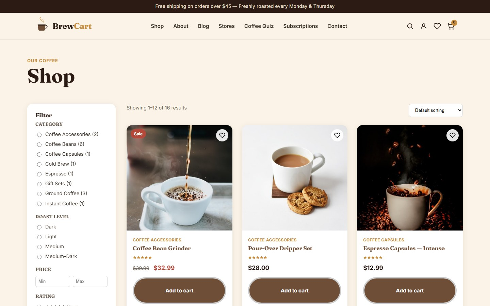
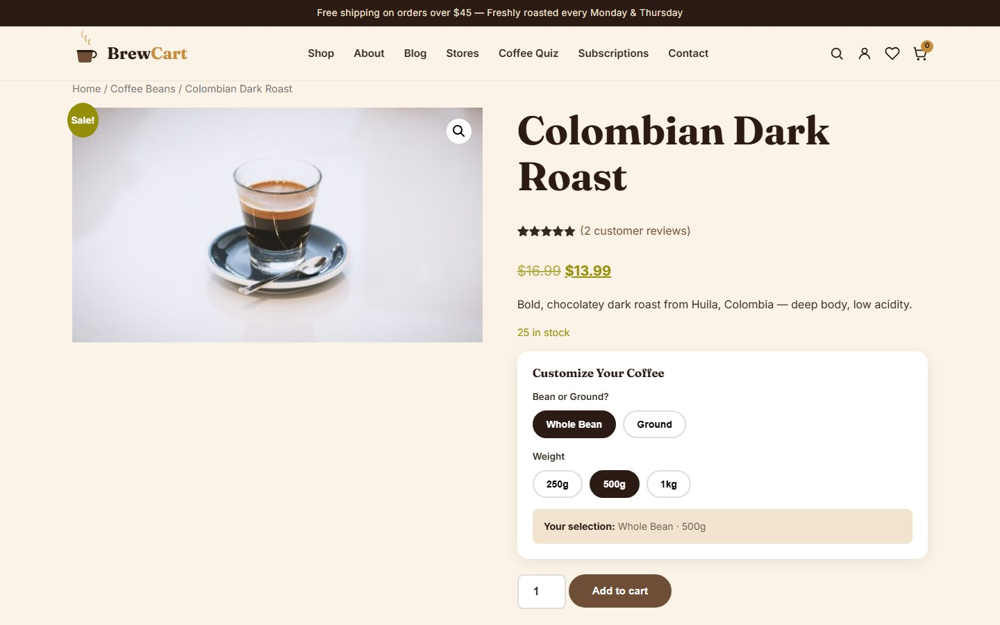
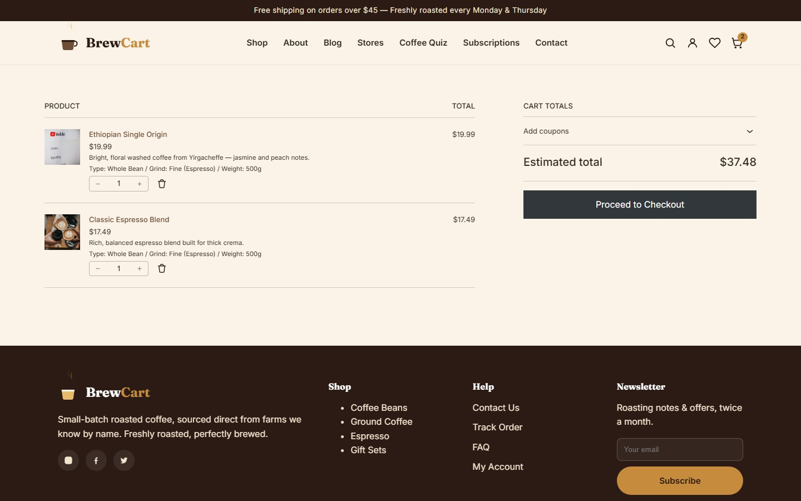

# BrewCart

BrewCart is a full featured e-commerce storefront for a small batch coffee roaster, built on WordPress and WooCommerce with a fully custom theme. It covers the complete shopping journey - browsing, filtering, product customization, subscriptions, checkout, order tracking, and account management - wrapped in a warm, coffee inspired design system.



## Overview

The site is built around a custom theme rather than a generic WooCommerce template, so every page shares the same color palette, typography, and interaction patterns. It includes real product data, working filters, a coffee recommendation quiz, a subscription flow, and a store locator, all wired up with proper nonce protected AJAX requests instead of static mockups.

## Features

### Storefront

- Custom animated logo and sticky header with a live cart count
- Homepage with an auto rotating hero banner, featured products, category tiles, best sellers, and customer reviews
- Filterable shop page - category, roast level, price range, rating, and stock status, with sorting
- Product pages with an image gallery, star ratings, tabbed description/attributes/reviews, and related products
- A "Customize Your Coffee" module for choosing bean or ground, grind size, and weight before adding to cart
- Wishlist with guest cookie support that merges into the account on login
- Cart and checkout built on WooCommerce blocks, with cross sell recommendations
- Order tracking by order number and email or phone, showing a delivery status timeline
- Coupon support with a first order discount, a free shipping threshold, and a general promo code

### Coffee Quiz

A short multi step quiz asks about drink style, roast preference, strength, grind preference, and flavor profile, then matches the answers against the catalog to recommend three products.



### Subscriptions

Customers can pick a coffee, a quantity, and a delivery frequency (weekly, every two weeks, or monthly). The form shows the discounted price, the delivery schedule, and the next delivery date before the subscription is added to the cart with a 10 percent recurring discount.



### Store Locator

A simple directory of physical store locations with address, phone, hours, and a direct link to get directions.



### Blog

Brewing guides, bean guides, recipes, and sourcing stories, each with a featured image, category, and excerpt.



## Shop and Product Pages







## Tech Stack

- WordPress and WooCommerce
- A custom classic theme (no page builder dependency for core templates)
- Elementor available for flexible content pages
- Yoast SEO for meta data, sitemaps, and structured data
- WooCommerce Stripe gateway for payment processing (gateway agnostic architecture - no card data is ever stored on the server)
- Vanilla JavaScript and jQuery for interactivity, no frontend framework
- MySQL for storage

## Design System

The theme uses a warm espresso and amber palette (deep browns, cream backgrounds, amber accents) with a serif display font for headings and a clean sans serif for body text. Buttons, cards, and form controls share consistent radii, shadows, and hover states across every page. Product images, category tiles, and blog thumbnails are all real photography rather than placeholders.

## Product Catalog

The catalog includes 16 coffee products across 8 categories (Coffee Beans, Ground Coffee, Espresso, Cold Brew, Instant Coffee, Coffee Capsules, Coffee Accessories, and Gift Sets), each with roast level, origin, and bean type attributes, pricing (including sale pricing on select items), stock status, and customer reviews.

## Security

- All custom AJAX endpoints verify a WordPress nonce before processing a request
- User input is sanitized on the way in and escaped on the way out
- No payment or card data is handled or stored by the application - all payment processing is delegated to the configured gateway
- File editing from the WordPress admin is disabled

## Mobile Experience

The layout is fully responsive, with a sticky bottom navigation bar on mobile (search, home, shop, wishlist, cart, account), touch friendly buttons, and no horizontal scrolling on any page.

## Project Structure

```
wp-content/themes/brewcart/
  assets/          Compiled CSS and JavaScript
  inc/             Feature modules (wishlist, quiz, subscriptions, store locator,
                   order tracking, contact form, security helpers)
  template-parts/  Reusable template fragments (product cards, etc.)
  woocommerce/     Theme overrides for WooCommerce templates
  functions.php    Theme setup, asset enqueueing, hooks
  header.php       Site header, navigation, search overlay
  footer.php       Site footer, mobile navigation
  front-page.php   Homepage template
  page.php         Default page template
```

## Getting Started

1. Set up a local WordPress environment (WAMP, MAMP, XAMPP, or similar) with PHP and MySQL.
2. Create a database and point `wp-config.php` at it.
3. Install WordPress core, then activate the BrewCart theme and the WooCommerce plugin.
4. Run through the WooCommerce setup to configure store address, currency, and shipping zones.
5. Import or create products, categories, and attributes matching the structure described above.

## License

This project is provided as is for demonstration purposes.
